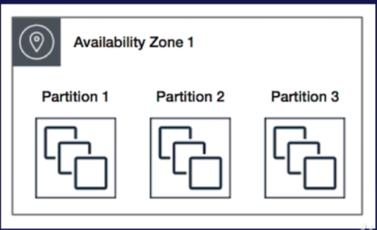
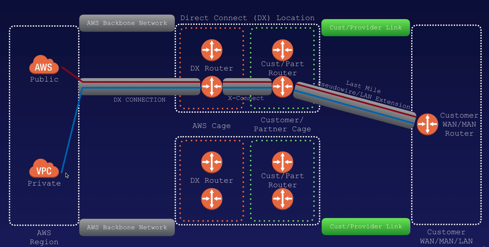

# AWS Certification Notes

- [AWS Certification](#aws-certification)
  - [Index](#index)
  - [Resources:](#resources)
  - [Udemy: AWS Certificate solutions architect 2019](#udemy-aws-certificate-solutions-architect-2019)
  - [AWS - 10000 foot overview](#aws---10000-foot-overview)
  - [Identity Access Management](#identity-access-management)
  - [S3](#s3)
    - [S3 Security And encryption](#s3-security-and-encryption)
    - [S3 Versioning](#s3-versioning)
    - [S3 Lifecycle management](#s3-lifecycle-management)
    - [S3 Cross-region replication](#s3-cross-region-replication)
    - [S3 Transfer Acceleration](#s3-transfer-acceleration)
    - [S3 Costs](#s3-costs)
  - [Cloudfront](#cloudfront)
  - [SNOWBALL](#snowball)
    - [Snowball EDGE](#snowball-edge)
    - [SnowMobile](#snowmobile)
  - [Storage Gateway](#storage-gateway)
  - [EC2 Elastic Compute Cloud](#ec2-elastic-compute-cloud)
    - [Pricing Model](#pricing-model)
    - [Security groups](#security-groups)
    - [EBS(Elastic block store)](#ebselastic-block-store)
    - [AMI Types(EBS vs Instance Store)](#ami-typesebs-vs-instance-store)
    - [Encrypted Root Device Volume & Snapshots](#encrypted-root-device-volume--snapshots)
    - [BOOTSTRAP SCRIPTS](#bootstrap-scripts)
    - [EC2 placement groups](#ec2-placement-groups)
      - [Clustered placement of group:](#clustered-placement-of-group)
      - [Spread Placement Group](#spread-placement-group)
      - [Partition Placement Group](#partition-placement-group)
  - [CLOUDWATCH](#cloudwatch)
  - [CLOUDTRAIL](#cloudtrail)
  - [The AWS CLI](#the-aws-cli)
  - [IAM Roles](#iam-roles)
  - [EFS](#efs)
  - [Databases](#databases)
    - [RDS BACKUPS](#rds-backups)
    - [RDS Encryption](#rds-encryption)
    - [RDS MULTI AZ](#rds-multi-az)
    - [RDS READ REPLICA](#rds-read-replica)
    - [DYNAMODB](#dynamodb)
    - [REDSHIFT](#redshift)
    - [REDSHIFT Encryption](#redshift-encryption)
    - [AURORA](#aurora)
    - [ELASTICACHE](#elasticache)
  - [ROUTE53 DNS](#route53-dns)
    - [Routing Policies](#routing-policies)
      - [Simple routing policy](#simple-routing-policy)
      - [Weighted routing policy](#weighted-routing-policy)
      - [Latency routing policy](#latency-routing-policy)
      - [Failover routing policy](#failover-routing-policy)
      - [Geolocation routing policy](#geolocation-routing-policy)
      - 
      - [Geoproximity routing policy](#geoproximity-routing-policy)
      - [Multivalue Answer policy](#multivalue-answer-policy)
  - [VPC](#vpc)
    - [NAT Instances (to allow private subnet to communicate with the internet. example: execute yum install….)](#nat-instances-to-allow-private-subnet-to-communicate-with-the-internet-example-execute-yum-install)
    - [NAT Gateways](#nat-gateways)
    - [Network Access Control List](#network-access-control-list)
    - [Bastion Host](#bastion-host)
    - [Direct Connect](#direct-connect)
    - [VPC Endpoint](#vpc-endpoint)
  - [Elastic Load Balancer](#elastic-load-balancer)
    - [Application Load Balancer](#application-load-balancer)
    - [Network Load balancers](#network-load-balancers)
    - [Classic Load Balancer](#classic-load-balancer)
    - [Sticky sessions](#sticky-sessions)
    - [Cross Zone Load Balancing](#cross-zone-load-balancing)
    - [Path Patterns](#path-patterns)
  - [High Availability](#high-availability)
  - [Cloud Formation](#cloud-formation)
  - [Elastic Beanstalk](#elastic-beanstalk)
  - [SQS](#sqs)
  - [SWF](#swf)
  - [SNS](#sns)
  - [Elastic Transcoder](#elastic-transcoder)
  - [API Gateway](#api-gateway)
  - [Kinesis](#kinesis)
  - [Web Identity Federation & Cognito](#web-identity-federation--cognito)
  - [AWS Lambda](#aws-lambda)

## Resources:

Aws Cheatsheet : [https://tutorialsdojo.com/aws-cheat-sheets/](https://tutorialsdojo.com/aws-cheat-sheets/)

Exam readiness by aws: [https://aws.amazon.com/it/training/course-descriptions/exam-workshop-solutions-architect-associate/](https://aws.amazon.com/it/training/course-descriptions/exam-workshop-solutions-architect-associate/)

Guide: [https://tutorialsdojo.com/aws-certified-solutions-architect-associate/](https://tutorialsdojo.com/aws-certified-solutions-architect-associate/)

## Udemy: AWS Certificate solutions architect 2019

Exam:

* 130 minutes length
* 60 Questions (can change)
* Multiple choice
* Results are between 100-1000 (pass 720,  ~70%)
* Qualification valid for 2 years
* Scenario-based questions

## AWS - 10000 foot overview

19 regions - 57 availability zones

**Availability zone** is one or more datacenter each with redundant power/networking and connectivity

**Region** is a physical location in the world geographical area ( 2 or more availability zones )

**Edge locations** are endpoints for AWS which are used for caching content. There are over 150 edge locations(small location just to cache contents).

Different **support plans**

* Basic Plan
* Developer Plan (from 29$ Months)
* Business Plan (from 100$ Month)

## Identity Access Management 

Manage users and their level of access to the AWS console. Set up users, groups, permissions/roles.

It Gives

* Centralized control of AWS account
* Shared access to your aws account
* Granular Permissions
* Identity Federation (include Active Directory, Facebook, Linkedin )
* Multifactor authentication
* Provide temporary access for users/devices and services where necessary
* Allows you to set up a password rotation policy
* Integrate with many AWS services
* Supports PCI DSS Compliance

Terminology: Users / Groups / Policies / Roles

Policies: JSON documents, give permissions as to what a User/Group/Role is able to do.

Roles: you create roles and then assign them to **AWS resources**

Iam is a Universal Global service ( you do not create users in a region)

Policy structure:

* Allow/Deny  ( permission )
* Action ( what action )
* Resource (on which resource )

The root account has administrator access, new users have no permissions when first created, ne users have Access key ID and Secret access keys when first created.

With keys you gain programmatic access (no access to the console). You only view once, if you lose them you have to regenerate them.

**Power users** are ones who have full access to **AWS** services but management of **IAM users** ,groups is not allowed to them. Yes, **power users** have access to all **AWS** service. But are not allowed to manage **users**, groups and roles.

Until 2018 there was a hard limit on S3 puts of **100 PUTs per second**. To achieve this care needed to be taken with the structure of the name Key to ensuring parallel processing. As of July 2018 **the limit was raised to 3500** and the need for the Key design was basically eliminated.

Best Practices:

* Always set up multifactor auth using an authenticator app
* You can create and customize your own password rotation policies

**Training - Billing alarm**:

* You get 10 free alarms and 1000 free email notifications each month as part of the free tier

## S3

* Simple storage service (object-based).
    * Key (name of the object)
    * Value( the data made up by the sequence of bytes )
    * Version ID (important for versioning)
    * Metadata ( data about data stored )
    * Subresources:
        * ACL
        * Torrent
* The data is spread across multiple devices
* Files can be from 0 bytes to 5 TB (The best solution is to **enable Multipart upload** for all files)
* An account can have by default **100 buckets**
* Unlimited storage
* Files are stored in buckets.
* S3 is a **universal** namespace.
* In S3 the minimum file size for an object is **0 bytes**

Consistency model: 

* **Read after write consistency** for PUTS of **new** Object
* **Eventual consistency** in overwrite **update** (PUTS e DELETE)

Guarantee:

* 99.9 availability (of what?)
* 99.99 availability (for the s3 platform)
* 99.99… (11x9) durability for s3 information

Features:

* Tiered storage available
* Lifecycle management
* Versioning
* Encryption
* MFA for **Deleting** an object
* Secure your data with ACL and policies

S3 Storage Classes(Tiers)

* **Standard**( **99.99 availability, 99.11x9%** **durability**, stored redundantly across multiple devices in multiple facilities, designed to sustain the loss of 2 facilities concurrently)
* **IA, Infrequently Accessed** ( for data accessed less frequently but requires rapid access when needed, Lower fee than Standard but there is a retrieval fee)
* **One Zone IA** (lower cost option for infrequently accessed, no multiple availability zone data resilience, **99.50% availability, low durability also**)
* **S3 Intelligent Tiering** ( optimize costs by automatically moving data to the most cost-effective access tier without performance or operational overhead, use Artificial intelligence)
* **S3 Glacier** (low-cost storage class for data archiving, retrieval time if configurable from minutes to hours)
* **S3 Glacier Deep Archive** (lowest cost, data retrieval time of 12 hours)

You pay for:

* Storage
* Requests
* Storage management Pricing
* Data Transfer Pricing
* Transfer acceleration (enable edge locations to be used to allow users to upload a file using a CDN instead of the AWS std network to improve upload speed)
* Cross-region replication

Example Bucket Url:

* [https://s3-{region}.amazonaws.com/{bucketname](https://s3-{region}.amazonaws.com/{bucketname)}

Not suitable for installing databases/applications/operating systems.

Read the S3 FAQs before taking the exam

It is possible to set S3 storage class on **bucket **level or at **object** level

### S3 Security And encryption

* Bucket Policies
* Access control lists

Different types of encryption:

* Encryption in transit (HTTPS), is achieved by using **SSL/this**
* Encryption at rest (server-side, if one break out and steal the hard disk won’t be able to decrypt the information inside without the key), is achieved by 
    * S3 Managed Keys(SSE-S3)
    * AWS Key Management Service (SSE-KMS)
    * Customer provided keys (SSE-C
* Client-Side encryption (you encrypt the files before uploading, not provided by aws) 

### S3 Versioning

* Store all versions of an object(writes and even deletions)
* Versioning cannot be disabled
* Integrates with Lifecycle rules
* Versioning’s MFA Delete capability can be used to provide an additional level of security

Uploading the same file changes its permissions.

You should take care of the dimension when architecting because the bucket can grow **EXPONENTIALLY** in weight(suggestion: **enable bucket versioning in conjunction with a lifecycle policy**) 

### S3 Lifecycle management

* Storage class transition (allow the migration of files to a less-expensive storage class)
* Expire your objects (allow the cleaning up)

Transitions for:

* The current version of objects
* Previous versions of objects

    

    Exam tips:

* Automate moving your objects between storage tiers
* Used in conjunction with versioning is a good idea

### S3 Cross-region replication

* When you enable cross-region replication, **the objects are not replicated automatically**
* You can change storage tier class in the target bucket
* You can sync with a bucket in a different account
* The region must be unique(cannot replicate in another bucket in the same region)
* **Deletions are not Replicated**
* Versioning must be enabled on both the source and destination buckets

### S3 Transfer Acceleration

* Use Cloudfront Edge network to accelerate your uploads to S3
* There is a tool to benchmark the upload time to different locations(and measure the improvement using s3 transfer acceleration): \
[http://s3-accelerate-speedtest.s3-accelerate.amazonaws.com/en/accelerate-speed-comparsion.html](http://s3-accelerate-speedtest.s3-accelerate.amazonaws.com/en/accelerate-speed-comparsion.html)
* Distinct URL instead: **acloudguru.s3-accelerate.amazonaws.com**

### S3 Costs

The key driver here is cost, so awareness of cost is necessary to answer this. Full S3 is quite expensive at around **$0.023 per GB** for the lowest band. **S3 standard IA is $0.0125 per GB**, **S3 One-Zone-IA is $0.01 per GB**. Of the offered solutions SS3 One-Zone-IA is the cheapest suitable option

READ THE S3 FAQ BEFORE TAKING THE EXAM!

[https://aws.amazon.com/it/s3/faqs/](https://aws.amazon.com/it/s3/faqs/)

## Cloudfront

Is a content delivery network, deliver web content to a user based on:

* The geographic locations of the user
* The origin of the webpage
* A content delivery server

Important definitions:

* **Edge Location**: this is the location where the content is going to be cached ( is different than a Region or AZ)
* **Origin**: this is the origin of all the files that CDN will distribute. This can be an **S3 Bucket, an EC2 instance, Elastic Load balancer or Route53**
* **Distribution**: the name given to the CDN ( is a group of edge locations)

Objects are cached using a Time to leave

Can be used to store the entire website including dynamic, static, streaming, and interactive contents, **requests are automatically routed to the nearest edge location**

Two types of distribution:

* Web distribution: use to 
* RTMP: used for media streaming

You can **write** to Edge locations (they are not strictly read-only, you can PUT objects to cloudfront)

You can **clear cached objects** but you will be changed.

Cloudfront is a **Global** service

You can link an S3 Bucket when creating a distribution and you can also specify a **specific path** inside the S3 bucket(**USECASE)**

You can **restrict the view** of content using **signed URL or signed Cookies** (**USECASE**: useful if you are a media company and for example, you need to restrict the content view only to premium/paid users)

You can set a Web Application Firewall (WAF) in front of a cloudfront distribution

## SNOWBALL

Is basically a big Disk.

**Petabyte** scale data transport solution that allows to import or export data from or to AWS.

⅕ of the cost of using an internet network.

50TB or 80TB

Snowball can import or export to S3

### Snowball EDGE

Aws snowball Edge is a 100TB data transfer device with onboard storage and **compute capabilities** ( basically a small aws platform bundled ). Support local or remote workload

### SnowMobile

Exabyte-scale data transfer service ( basically a truck ), 100 PB per Snowmobile.

## Storage Gateway

A virtual or physical device, use to move data into AWS, connect on-premises software with cloud base storage.

Is downloaded as a Virtual machine

Three different flavored:

* **File Gateway(NFS & SMB)** \
For flat files, files are stored as **objects in your S3 Buckets** accessed through a Network File System(NFS) mount point
* **Volume gateway (iSCSI) \
**Files are stored with **block protocol using AWS EBS** snapshot to S3, snapshots are incremental backups that capture only changed blocks. Used to store your 
    * Stored Volumes \
Store **Entire dataset**
    * Cached volumes \
Store **only the actively used data**
* **Tape gateways \
**Getting rid of tapes basically

## EC2 Elastic Compute Cloud

Resizable compute capacity in the cloud. Reduces the time required to obtain and boot new server instances to minutes.

### Pricing Model

* On-Demand(Pay at a fixed rate by the hour or by the second with no commitment)
* Reserved (Capacity reservation and offer a significant discount, contract are 1 Year or 3 Years)
* Spot Instance(**Bid** whatever price you want for instance capacity)
* Dedicated Hosts(Physical EC2 Server dedicated for your use)

On-Demand (USECASE):

* Users that want the low cost and flexibility of EC2 without any up-front payment or long term commitment
* Spiky application or unpredictable workloads
* Applications being developed and tested on EC2 for the first time

Reserved (USECASE):

* Steady-state or predictable usage
* Applications that require reserved capacity
* Users are able to make **upfront payments** to reduce their total computing cost
1. Standard reserved instances
2. Convertible reserved instances(allows changes to instances type)
3. Scheduled reserved instances

Spot instances(USECASE)

* Applications that have flexible start and end times
* Applications feasible at very low compute prices
* Users with urgent computing needs for large amounts of additional capacity

If the spot instance is terminated by amazon EC2 you will not be charged for a partial hour of usage. If Instead, you terminate the instance yourself you will be charged for any hour in which the instance ran.

Dedicated Hosts(USECASE)

* Regulatory requirements that may not support **multi-tenant** virtualization
* Licensing that does not support **multi-tenancy** or cloud deployments
* Can be purchased on-demand
* Can be purchased as a reservation for up to 70% off the on-demand price

Exam tips

* Termination protection is turned off by default, you must turn it on
* On an EBS-backed instance, the default action  is for the root EBS volume to be deleted when the instance is terminated
* EBS Root Volumes of your DEFAULT AMI’s cannot be encrypted. You can also use a third party tool to encrypt the root volume or this can be done when creating AMI’s in the AWS console or using the API
* Additional Volumes can be encrypted

### Security groups

Basically is the Firewall

* Changes in security groups take effect **immediately**(exam tip)!
* Security groups are **stateful** (if you create a rule that allows traffic **IN**, it automatically allow traffic **OUT** for the same protocol/port)
* With security groups, you can’t block a single port/ip address(instead use Network access control lists ->NACL), because all inbound traffic is blocked by default
* All Outbound traffic is allowed
* You can have any number of EC2 instances within a security group
* You can have multiple security groups attached to EC2 Instances

### EBS(Elastic block store)

* Automatically replicated within its availability zone

Different kinds of EBS

* General-purpose (SSD)
* Provisioned IOPS (SSD)
    * Highest performance SSD
* Throughput Optimised hard disk drive (Magnetic)
    * Low-cost volume
* Cold Hard drive(Magnetic)
    * Lowest cost
* EBS Magnetic
    * Previous generation HDD
    * Infrequently accessed objects

Exam tips

* The EBS volume is in the **same availability zone** of the EC2 linked to it
* You can modify volumes without terminating the instance(it just take some time)
* To **migrate** an EC2 **from an availability zone to another**:
    * Take a snapshot of the root volume
    * Create an Image from the snapshot
    * Create an EC2 instance from the saved image
        * Select a different availability zone as you prefer
* To **migrate** an EC2 to **another region**:
    * Take a snapshot of the root volume
    * Create an Image from the snapshot
    * Select “Copy AMI” and copy the image to another region
    * Create an EC2 instance from the saved image
* What happens to volumes when you terminate an EC2 instance?
    * By default, the root volume will be terminated but any additional volume will persist and will be available for future mounts
* Snapshots are persisted on S3
* Snapshots are point in time copies (they are copied at a precise time)
* Snapshots are incremental, only the delta is copied to S3
* You can add multiple volumes to an EC2 instance and then create your own **RAID 5/RAID 10/RAID 0** configurations using those volumes
* For the first snapshot, it takes some time because it has to copy everything
* You can create snapshots of any volumes(root or not) without stopping the EC2 instance. (To be **consistent** you can stop the instance)
* You can Create AMI from both Volumes and Snapshot
* You can change EBS volume size and type on the fly

### AMI Types(EBS vs Instance Store)

Different types

* EBS
    * Created from an EBS storage snapshot
* Instance Store
    * Created from a template stored in S3

Select AMI based on:

* Region
* OS
* Architecture(32/64 bit)
* Launch permissions
* Storage for the root device
    * Instance Store(Ephemeral Storage)
    * EBS Backed volumes

Exam tips:

* If you create an Instance Store backed EC2 instance you can add additional instance storage volumes in the creation process(after you can just add EBS storages)
* Instance store volumes cannot be stopped. If the underlying host fails you will lose your data
* EBS backed instances can be stopped. You will not lose the data on this instance if it is stopped
* You can reboot both, you will not lose data
* By default, both ROOT volumes will be deleted on termination. With EBS you can set a flag to avoid deletion on instance termination

### Encrypted Root Device Volume & Snapshots

Exam tips:

* You can enable the root device encryption while you are creating the EC2 instance and you are configuring the root storage device
* (USECASE) You have already an unencrypted root device and you have to crypt it, How to?? 
    * Take a snapshot
    * Copy the snapshot(enable encryption on the copy)
    * Create an Image(AMI) from the snapshot
    * Now you can create an EC2 instance from the AMI image created from an encrypted device
* You cannot launch an Unencrypted volume if you are starting from an Encrypted Snapshot
* You can share snapshots but only if they are unencrypted
* These snapshots can be shared with other AWS accounts or made public

### BOOTSTRAP SCRIPTS

Exam tips:

* Bootstrap scripts can be saved as text while launching a new ec2 instance
* Bootstrap scripts are executed at the instance launch, you can create new aws resources/install software on ec2/…
* You can use **curl** commands inside an EC2 instance to retrieve information about the just-launched ec-2 instance
    * **curl** [http://169.254.169.254/latest/user-data](http://169.254.169.254/latest/user-data) (contains the bootstrap scripts)
    * **curl** [http://169.254.169.254/latest/meta-data](http://169.254.169.254/latest/meta-data) (contains the instance metadata, ip address, etc…)

### EC2 placement groups

A way of placing your ec2 instance. There are three types:

#### Clustered placement of group:

* EC2 are placed “close to each other” into the **same AZ**
* Recommended for applications with low network latency, high network throughput, or both
* Only certain instances can be launched into a clustered placement group

#### Spread Placement Group

* The opposite idea of the clustered, the instances are placed on distinct hardware
* Recommended for applications that have a small number of critical instances separate from each other
* Protect from hardware failure
* You can spread instances through **different AZ**

#### Partition Placement Group

* Similar to spread but putting instances into partitions, each partition contains multiple instances and run on separate hardware (racks)

Exam Tips:

* A clustered placement group can’t span multiple availability zones(a spread placement group can)
* The name you specify for a placement group must be unique within your aws account
* Only certain types of instances can be launched in a placement group ( Compute Optimized, GPU, Memory Optimized, Storage)
* Aws recommend homogenous instances within clustered placement groups
* You can’t merge placement groups
* Spread placement groups have a specific limitation that you can only have a maximum of **7 running instances** per Availability Zone
* You can’t move an instance to a placement group but you can snapshot and create an AMI and launch a new instance copy to the placement group
* Remember the different group types

## CLOUDWATCH

Monitoring service to monitor AWS resources and applications.

Monitors Performance

Can Monitor:

* Compute
    * EC2 Instances
    * Autoscaling groups
    * ELB
    * Route 53
* Storage& Content delivery
    * EBS Volumes
    * Storage Gateways
    * Cloudfront
* ….

Exam tips:

* EC2 monitoring(CPU, Network, Disk, Status Check)
* Can monitor most of the applications that run at AWS
* On EC2 Cloudwatch can monitor events on a 5 minutes basis
* You can request a more granular check (enable 1-minute basis). You can enable this when you are launching the EC2 instance
* You can create trigger alarms that notify 
* You can create Dashboards
* You can create Cloudwatch Events that help you to respond to state changes in your AWS resources.
* You have Logs that help you to aggregate, monitor, and store logs data

## CLOUDTRAIL

Used to monitor API calls to AWS (monitor user activities)

Cloud trail is about **auditing**

## The AWS CLI

Exam tips:

* Do not store credentials on github or on EC2 instances, instead use Roles
* You will need to set up access in IAM and use “aws configure” command

## IAM Roles

Exam tips:

* Role change take effect immediately
* Roles are universal, can be used in any region
* Roles are more secure than storing your access key and secret access key on individual EC2 instances
* Roles are easier to manage

## EFS

Elastic file system used for EC2 instances, similar to EBS.

(USECASES)

* Share files between different EC2 instances(example, share httpd html files across instances)
* Do not preallocate space but elastically add space when needed

Exam tips:

* EFS support NFS protocol version 4
* You only pay for the storage you use(no preprovisioning)
* You scale up to petabytes
* Can support thousands of concurrent NFS connections
* Data stored across the AZ within a single region
* Read after write consistency (like S3)
* You can mount an EFS with bash **mount** commands **inside** the EC2
* The differences with EBS are:
* You cannot share EBS to multiple instances(you can do that on EFS)
* Storage capacity with EFS is **elastic**, grow and shrink automatically as you add files

## Databases

Relational Databases on AWS:

* Microsoft SQL Server
* Oracle
* Mysql
* PostgreSQL
* Aurora
* MariaDB

RDS has two key feature

* Multi-AZ for disaster recovery
* Read Replica for performance

Data warehousing

* Very large and complex datasets
* Use a different type of architecture both from a database perspective and infrastructure layer
* **Amazon RedShift!!**

OLTP: Online **Transaction** processing

OLAP: Online **Analytics** Processing

RDS(OLTP)

Dynamodb(NoSql)

Redshift (OLAP)

Elasticache(speed performances)

Exam Tips:

* RDS runs on virtual machines(you don’t have access, you cannot ssh to those instances)
* Patching the RDS is amazon responsibilities
* RDS is not serverless
* Aurora serverless is serverless

### RDS BACKUPS

Two types:

* Automated backups
    * Point in time can be one and 35 days
    * Backups are enabled by default and stored to S3
    * They weight the same as your database
    * Backups are defined in a defined windows
* DB Snapshot
    * Done manually
    * Stored even after you delete the database

When you restore, you are not going to restore to the same DB. Instead, it creates a new database with a new dns endpoint

**Question**: Which AWS DB platform is most suitable for OLTP? RDS

### RDS Encryption

Support by all RDS databases, use KMS, every backup is encrypted after you enable it.

(Question):When you add a rule to an RDS DB security group, you must specify a port number or protocol? -> FALSE(Technically a destination port number is needed, however with a DB security group the RDS instance port number is automatically applied to the RDS DB Security Group.)

### RDS MULTI AZ

Multi AZ allows you to have an exact copy of your production database in another availability zone. AWS handles the replication.

In case of planned database maintenance or db failure, amazon RDS will automatically failover to the other. (you can not change the connection string etc)

Multi AZ is for disaster recovery only(is not used per improving performance)

Available for

* SQL Server
* Oracle
* MYsql
* PostgreSQL
* MariaDB

RDS Reserved instances are available for multi-AZ deployments.

### RDS READ REPLICA

Used to improve performances.

Asynchronous replication, used for heavy-read database performance

Available for :

* Mysql
* PostgreSQL
* MariaDB
* Oracle
* Aurora

Exam tips:

* Used for scaling, not for disaster recovery
* Must have automated backups turned on in order to deploy a read replica
* You can have up to 5 read replica copies of any database
* You can have read replica of read replicas(but watch the latency)
* Each read replica will have its own DNS endpoint
* You can have read replica that have multi AZ
* You can create read replicas of Multi AZ source databases
* Read replicas can be promoted to be their own databases. This breaks the replication
* You can have a read replica in a second region
* There is no data transfer charge(you do not pay for data transfer) for replicating data

### DYNAMODB

Fast and flexible, app that requires single-digit millisecond latency, fully managed database.

* Stored on SSD Storage
* Spread across 3 geographically data centers
* Eventual consistent Reads(Default)
    * 1 second to update all replicated copies
* Strongly consistent reads
    * Less than 1 seconds read consistency

Exam Tip:

* **ProvisionedThroughputExceededException**: this error happens when the throughput is not balanced across your partitions.One partition is being subjected to a disproportionate amount of traffic and is, therefore, exceeding limits

### REDSHIFT

OLAP DATABASE(Business intelligence in the cloud) 

Scale to petabytes of data.

Uses different architecture than a traditional database

Redshift can be configured as follow:

* Single Node(160 Gb)
* Multi Node:
    * Leader Node(manages client connections and receives queries)
    * Compute Node(store data and perform queries and computation). Up to 128 compute nodes

Allow advanced compression. Redshift does not require indexes or materialized views(investigate…)

Massively parallel processing(MPP) Redshift automatically distributes data and query load across all nodes and enables you to maintain fast query performance as your data warehouse grow

Backups:

* Enabled by default with 1-day retention
* Maximum retention 35 days
* Redshift always attempt to maintain at least three copies of your data
* Redshift can also asynchronously replicate snapshots to s3 in another region for disaster recovery

Pricing

* Compute Node Hours ( but you won’t be changed for leader node hours)
* You pay for backups
* You pay for data transfer(only within a vpc, not outside it)

Can only be used in Single Availability Zone

### REDSHIFT Encryption

* Encrypted in transit using SSL (HTTPS)
* Encrypted at rest using AWS-256
* By default, Redshift takes care of key management
    * AWS KMS
    * Manage your own Key

### AURORA

Mysql compatible relational database.

Five times performance than Mysql, compatible with Mysql Postgres.

* Start with 10 Gb instance, scale in 10 Gb increments to 64TB
* Compute resource scale up to 32 vcpus and 244 Gb of memory
* 2 copies of your data is contained in each availability zone(minimum 3 AZ) 6 copies of your data
* Aurora is self-healing. Data blocks and disks are continuously scanned for errors and repaired automatically
* Automatically backups are always enabled on Aurora. Backups do not impact DB performance
* You can take snapshots, this does not impact performance
* You can share aurora snapshots with a different AWS account

Two types of aurora replicas

* Aurora Replicas (currently 15)
* Mysql read replicas(currently 5)

Other Exam tips:

* Two ways to migrate from Mysql to Aurora Db:
    * Take a snapshot and restore it to an Aurora Db
    * Create an Aurora Read Replica and promote

### ELASTICACHE

Web service that makes easy to deploy operate and scale in-memory cache in the cloud

Supports:

* Memcached
* Redis

Exam tips:

* Increase database and web application performance
* Redis is Multi AZ
* You can do backups with Redis

## ROUTE53 DNS

Dns, used to convert friendly domain name to ip address

Ipv4 is 32but field, 4 billion different addresses

Ipv6 address 128 bits 

Top level domain names:

* .com
* .uk
* .it

Controlled by a centralized authority [www.iana.org/domains/root/db](www.iana.org/domains/root/db)

CNAME: canonical name, resolve one domain name to another one:

Example: [http://m.acloud.guru](http://m.acloud.guru).com -> [http://mobile.acloud.guru](http://mobile.acloud.guru.com).com

Alias: the same as CNAMe, the difference is that cannot use CNAME for naked domains(you cannot have a CNAME for [http://acloud.guru](http://m.acloud.guru), it must be either an A record or an Alias, you need the “www”)

Exam Tips:

* ELB does not have a predefined Ipv4 addresses, you use a DNS name
* Understand the difference between an alias record and CNAME
* Given the choice, always choose an Alias over a CNAME
* Common DNS record types:
    * SOA Records
    * NS Records(identifies the name servers for the hosted zone)
    * A Records(resolve name to ipv4)
    * AAAA Records(resolve name to ipv4)
    * Alias Records(resolve name to another name)
    * CNAMES(resolve name to another name - no naked domains)
    * MX Records(used for emails)
    * PTR Records(reverse of A records, resolve to names from ipv4 addresses)
* You can buy a domain name in AWS
* Can take up to 3 days to register
* You can set health checks on individual record set
* You can set SNS notifications if a check fail
* There is a limit on the domain names you can have -> 50 (you can increase this limit by contacting AWS support)

### Routing Policies

Different types of routing:

#### Simple routing policy

You can have only one record with multiple ip addresses. If you specify multiple values in a record, route53 returns all values to the user in a random order      

#### Weighted routing policy

Split traffic based on different weights assigned.

For example 10% of traffic in a region(or AZ) and the others to other

#### Latency routing policy

Split the traffic based on the lowest latency routing

#### Failover routing policy

Active/Passive setup. Has primary(active) set and secondary(passive) set. Send traffic to passive when he detects a failure on the primary set

#### Geolocation routing policy

Lets you choose the traffic based on the geolocation traffic of your user.

Used to lock down the users to a specific **continent or nation**.

(**USECASE**) An ecommerce where the european users should see the right currency(euro) and the US another one(dollar)

#### 

#### Geoproximity routing policy

Route traffic based on the geographic location of your users and resources.

In this case, you must use Route53 traffic flow

#### Multivalue Answer policy

Similar to Simple Routing Policy, lets you configure Route53 to return multiple values and allows you to **evaluate the health of the endpoints using healthchecks**.

(Basically is a Simple routing with **healthchecks**)

## VPC

Virtual data centre in the cloud. Logically isolated section, have a complete selection of network.

Additionally, you can create a Hardware Virtual Private Network connection between **your corporate data center** and your VPC and leverage the AWS cloud as an extension of your corporate datacenter

Default VPC allows you to immediately deploy instances.

All Subnet in the default VPC has a route out to the internet.

Each EC2 instances has both a public and a private IP address

(quiz: Although creating a new NIC & associating an EIP also results in your instance being accessible from the internet, it leaves your instance with 2 NICs & 2 private IPs as well as the public address and is therefore not the simplest solution. By default, any user-created **VPC subnet WILL NOT automatically assign public IPv4 addresses to instances** – the only subnet that does this is the “default” VPC subnets automatically created by AWS in your account.)

(quiz: Until recently customers were not permitted to conduct **penetration testing** without AWS engagement. However that has changed. There are still conditions though.)

(quiz: By default, you can have **5 VPCs** per AWS region?)

**VPC Peering**: connect one VPC with another(you can peer with other account).

But you cannot transitive peering!

You can peer between different regions

* Logical datacenter in AWS
* Consists of:
    * IGW(Virtual private gateways)
    * Route tables
    * Network Access control Lists
    * Subnets
    * Security Groups
* 1 Subnet = 1 availability zone
* Security groups are stateful; Network Access control lists are stateless
* No transitive peering

Exam Tips:

* When you create a VPC, these resources are created:
    * A Route table
    * A default NACL
    * A default Security Group
* It won’t create any subnets or Internet gateway
* Us-east-1a in your AWS account can be completely different AZ to US-east-1a in another account.The AZ are randomized
* Amazon always reserve 5 IP address per subnet
* You can only have 1 Internet Gateway per VPC
* Security Groups cannot be used across different VPCs
* You need at least 2 public subnets in order to create an Application Load Balancer in a custom VPC

### NAT Instances (to allow private subnet to communicate with the internet. example: execute yum install….)

* When creating a NAT instance disable Source/Destination Check on the instance
* NAT instances must be in a public subnet
* There must be a route out of the private subnet to the NAT instance
* The instance is often a bottleneck, if there are performance issues you should increase the instance size or create a high availability using autoscaling groups etc.
* NAT instances are betweeb Behind a security group
* In the real world you would never use NAT instances but you should prefer NAT Gateways

### NAT Gateways

* Redundant inside the AZ (for performance)
* Preferred by the enterprise
* Starts at 5Gbps and scales currently to 45 Gbps
* No Need to patch
* Not associated with security group
* Automatically assigned a public IP address
* Need to update the route table
* No need to disable Source/Destination Checks

(USECASE):If you have a NAT Gateway in an AZ with multiple instances in different AZs connected you should consider the fact that if the AZ containing the NAT is down, every instance lose internet access.

You can create **different NAT gateways in different AZ** in order to achieve the best availability

### Network Access Control List

Exam Tips:

* VPC comes automatically with a **default** ACL and by default **allows** all inbound and outbound traffic
* You can create **custom** networks ACL and by default each custom network ACL **denies** all outbound and inbound traffic until you add rules
* Each subnet in your VPC must be associated with a network ACL(by default use the default ACL)
* You can Block IP addresses using NACLs(you cannot do that with security group)
* You can associate a network ACL with multiple subnets
* You can associate a ACL with multiple subnet but a subnet can be associated with just one ACL at a time
* NACl contains a numbered list of rules evaluated in order(from the lowest to the higher)
* NACL have separate inbound and outbound rules, each rule can either allow or deny traffic
* NACLs are stateless; responses to allowed inbound traffic are subject to the rules for outbound traffic (and viceversa)

VPC Flow Logs

Flow logs are a feature that enables you to capture information about the IP traffic going to and from the resources in your VPC(they are stored in Amazon Cloudwatch Logs)

They can be created at 3 levels:

* VPC
* Subnet
* Network Interface Level

Exam Tips:

* You can only enable flow logs for VPC in your account (even if they are peered)
* You cannot tag a flow log
* You cannot change the flow logs configuration after you’ve created it
* Not All Ip traffic is monitored:
    * Traffic generated by instances when they contact the Amazon DNS server
    * Traffic generated by a windows instance for amazon windows license activation
    * Traffic to and from 169.254.269.254 for instance metadata
    * DHCP traffic
    * Traffic to the reserved IP address for the default VPC router

### Bastion Host

Used to reach(SSH into) instances in private subnets.

Exam tips:

* NAT instance behind a Security group or a NAT gateway(better, more redundant) is used to provide internet access to an EC2 instance in a private subnet. Bastion hosts are placed in public subnet and are used to ssh into EC2 in private subnets
* Bastions are called Jump Boxes in Australia
* You cannot use a NAT Gateway as a bastion host

### Direct Connect

It is a cloud service that allows a private connection between the premises servers to AWS. Usually in many cases: 

* reduce the network 
* Increase bandwidth throughput
* Provide more consistent network experience than Internet-based connections

Exam Tips:

* Connect your data center to AWS
* Useful for high throughput workloads(Lots of network traffic)
* Stable and reliable secure connection

### VPC Endpoint

Allow you to privately connect your VPC to supported AWS services and VPC endpoint services without requiring an Internet Gateway, NAT device, VPN connection or AWS direct connect.

Traffic between your VPC and the other service does not leave the Amazon Network

Two types of VPC endpoints:

* Interface Endpoints
    * ENI(elastic network interface) that serves as an entry point for traffic destined to a supported service(api gateway/Kinesis/SNS/SQS/…)
* Gateway Endpoints
    * ENI is similar to the interface endpoint but supports these two:
        * S3
        * DynamoDB

## Elastic Load Balancer

Virtual or physical device to balance the load.

Different kinds of load balancers:

* Application Load Balancer
* Network Load Balancer
* Classic Load Balancer

### Application Load Balancer

Balancing of HTTP/HTTPS traffic. They operate at layer 7 and are application-aware. They can see inside the request and can make intelligent decisions.

### Network Load balancers

Extreme performance required. Operating at connection Level(level 4). Capable of handling millions of requests per second, while maintaining ultra-low latencies(extreme performance)

### Classic Load Balancer

Legacy application.You can load balance HTTP/Https applications and use Layer7 specific features such as **X-Forwarded-for(contiene l’ip dell’utente che ha fatto la chiamata)** and sticky sessions. You can also use Layer4 load balancing for applications that rely purely on the TCP protocol.

A typical error is a 504(Gateway timeout) means that the application is having problems and not responding(at DB or webserver level)

Exam Tips:

* Application Load Balancer ( intelligent routing)
* Network Load Balancer (extreme performance)
* Classic Load Balancer (keep the costs low)
* Load Balances have their own DNS name. You are never given an IP address
* Read the ELB FAQ for classic load balancers

### Sticky sessions

Allowed by Classic Load Balancer and Application Load Balancer

### Cross Zone Load Balancing

### Path Patterns

Used in microservices, for example, use the request “path” to balance the requests

## High Availability

Chaos Monkey: [https://medium.com/netflix-techblog/the-netflix-simian-army-16e57fbab116](https://medium.com/netflix-techblog/the-netflix-simian-army-16e57fbab116)

## Cloud Formation

Create infrastructure as code in order to be able to create and destroy the entire stack at once

* A way to script your cloud environment
* Quickstart is a bunch of pre-defined cloudformation templates

## Elastic Beanstalk

A simple way to deploy applications in the cloud without the need to know how to implement autoscaling etc.

* 3 types of load balancer
    * Application Load Balancers (Intelligent routing decisions)
    * Network load balancer (Extreme performance)
    * Classic Load Balancer ( Cost-efficient)
* 504 means “gateway timeout” - application is not working (can be the webserver or the database)
* If you need public IP address **ipv4** for end user look for **X-Forwarded-For** header
* Instances monitored by ELB can be (InService/OutOfService)
* Load Balancers have their own DNS name
* Read the ELB FAQ
* Sticky sessions enable users to stick to the same EC2 instance
* Cross Zone Load balancing enables you to load balance across multiple availability zones
* Path patterns allow you to direct to different EC2 instance based on the **URL path**

**Note: learn about definitions: \
**Availability: Availability can be described as the % of a time period when the service will be able to respond to your request in some fashion

Durability:Durability refers to the on-going existence of the object or resource. Note that it does not mean you can access it, only that it continues to exist

Resiliency:Resiliency can be described as the ability to a system to self heal after damage or an event. Note that this does not mean that it will be available continuously during the event, only that it will self recover

Reliability: Reliability is closely related to availability, however, a system can be 'available' but not be working properly. Reliability is the probability that a system will work as designed

## SQS

Give access to a message queue

Allow to  Decouple components that can run independently

* **256 Kb** of text in any format(soft limit)

Act as a buffer between components

* Standard queues
    * More than one copy of the message can be delivered
* FIFO queue
    * Ordered
    * Exactly one time processed
    * Support message groups
    * 300 TPS(transaction per second)

Exam tips

* SQS is **Pull** based 
* Messages are 256Kb by default
* Messages can be kept in the queue from 1 minute to 14 days(the default period is 4 days)
* **WaitTimeSeconds**: When the consumer instance polls for new work, the SQS service will allow it to wait a certain time for one or more messages to be available before closing the connection (for basically grouping messages)
* **Visibility timeout**: the amount of time that the message is invisible in the SQS queue after a reader picks up that message.  \
If the message is processed in this time it will be successfully removed from the queue(else it will remain in the queue and the result is that it could be delivered twice)
* **Maximum visibility timeout is 12 hours**
* SQS guarantees the process of the message at least once
* Amazon SQS long polling is a way to retrieve messages from your amazon SQS queues(a way to saving money)

## SWF

Amazon simple workflow service. 

Coordination of tasks

* SQS has a retention period of 14 days, SWF -> 1 year
* SWF has a task-oriented API
* SWF ensure that a task is assigned only once and is never duplicated
* SWF keeps track of all the tasks and events in an application
* SWF Actors:
    * Workflow starters
    * Deciders - control the flow of activity tasks
    * Activity workers - Carry out the activity tasks

## SNS

Simple Notification Service.

Send notifications from the cloud.

Delivers notifications directly to mobile devices /SMS /http endpoints

SNS allows you to group multiple recipients using topics.

To prevent messages from being lost all messages published to AMAZON SNS are stored redundantly across multiple AZs.

Exam tips:

* Push based delivery
* Simple API
* Flexible message delivery
* Inexpensive pay as you go

SNS vs SQS

* Push vs pull-based
* Both messaging services in AWS

## Elastic Transcoder

* Media transcoder in the cloud
* Convert media files from their original source format to different formats that will play on smartphones, tablets,PCs, etc
* Provide transcoding presets for popular output formats, which means that you don’t need to guess about which settings work best on particular devices
* Pay based on the minutes and the resolution

## API Gateway

Api gateway, acts as a front door for your application

Expose https endpoints to define RESTFUL APIs

Connect service like lambda and dynamodb

Scale effortlessly

Track and control usage by API key

Throttle requests to prevent attacks

Connect to cloudwatch to log all requests for monitoring

Maintain multiple versions of the api

* Uses apigateway domain by default
* Can use a custom domain
* Now supports AWS certificate manager

You can cache your endpoints response. And you can improve the latency.

You specify a TTL in **seconds **

API Gateway allows enabling **CORS** to relax the same-origin policy on the server

Exam Tips:

* A door to you AWS env
* Caching capabilities
* Low cost and scale automatically
* You can throttle API Gateway to prevent attacks
* CORS enforced by the browser

## Kinesis

Manage Streaming data( data generated continuously in small size)

Example:

* Stock prices
* Game data
* Social network data
* Purchases online
* Geospatial data(ex uber/gmaps)
* iOT sensor data

Kinesis makes it easy to load and analyze streaming data.

There are 3 Types of Kinesis:

* Kinesis Streams
    * A place to Store the data streamed, usually store for 24 hours (up to 7 days)
    * Consist of **shards**:
        * 5 transactions per second for reads(Each **read** transaction can provide up to 10,000 records with an upper quota of 10 MB per transaction)
        * Up to a maximum total read of 2 Mb per second
        * Up to 1000 records per second per write
        * Up to a maximum total write of 1 Mb per second
    * Total capacity in the stream is the sum of the shard 

* Kinesis Firehose
    * There is no persistence
    * You have to analyze the data as soon as they arrive ( for example using a lambda function )
* Kinesis Analytics
    * Works with Kinesis **Streams** and **Firehose** and allow you to analyze data on the fly inside either service

Exam Tips:

* Know the difference between the three services

## Web Identity Federation & Cognito

Web identity federation lets you give your user access to AWS resources after they have successfully authenticated with a web-based identity provider like Amazon/Google or Facebook

Cognito allows to:

* Sign in - Sign out to your apps
* Access for guest users
* Act as identity broker between your app and Web ID Providers
* Synchronizes data for multiple devices
* Recommended for all mobile apps on AWS

Map to IAM Role

User Pool:

* User directories used to manage sign-in and sign-up
* Users can sign in directly with the user pool or use facebook Amazon or Google
* Successfully authentication generates a JWT

Identity Pool:

* Enable provide temporary AWS credentials to access AWS services like S3 or Dynamodb
* Is all about **authorization **to AWS resources

Cognito uses Push Synchronization to push updates and synchronize user data across multiple devices. Cognito uses SNS to send a notification to all devices associated with a given user identity whenever data stored changes

Exam Tips:

* User authenticates first with a web id provider and receives an authentication token. \
The token is exchanged for temporary AWS credentials allowing them to assume an IAM role
* Cognito handles interaction between your application and the Web ID provider
* User pool is user-based, it handles things like user registration, authentication, and account recovery
* Identity pools authorize access to your AWS resources

## AWS Lambda

Event-driven serverless compute service

* Lambda Scales out(not up) automatically
